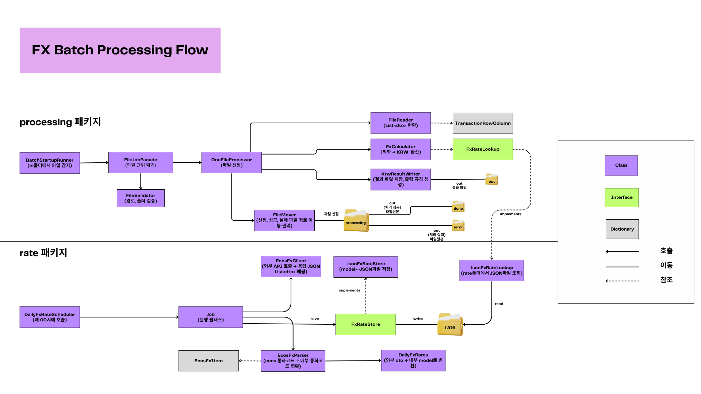

## autocore_fx_batch
한국은행 ECOS Open API와 환율 JSON 캐시를 활용해 CSV 외화 데이터를 KRW로 변환하는 Spring Boot 배치 프로그램

# 설계포인트
1. 파일을 처리할때 선점 구조를 적용하여 처리 상태를 구분하고 파일의 위치에 따른 상태 표현이 되도록 설계. 이후 병렬 처리로 확장하더라도 동일한 흐름을 유지할 수 있도록 고려
2. 
